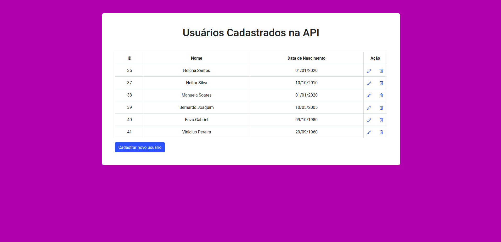

## API - Finnet

### Objetivo

+ Criar um micro serviço com um framework php de sua escolha
+ O micro serviço deverá ter as seguinte rotas:
  + POST|PUT /user
  + GET /user/:id
  + DELETE /user/:id
+ O JSON para inserção de usuário será o seguinte: { "nome": "José", "data_nascimento": "01/01/1999" }

### Features
Para o desenvolvimento do projeto foram utilizadas as seguintes tecnologias:
+ PHP
+ Framework Laravel
+ JQuery/Ajax
+ Banco de Dados MySql
+ HTML / CSS / Bootstrap

### Instalação

Clonar repositório:
```
git clone https://github.com/mateusdearaujo/api_finnet.git
```
Para instalar os pacotes necessários:
````
composer install
````
Após configurar o Banco de Dados no arquivo .env, execute o comando abaixo para criar as tabelas:
```
php artisan migrate
```

### Uso

Após configurar, rode o comando:
```
php artisan serve
```

### Como a API funciona

Ao enviar ou solicitar uma requisição, a API irá retornar um JSON com o formato abaixo:
```json
{
"error": "",
"result": []
}

Caso ocorra algum erro, o JSON irá retornar com a chave "error" preenchida, exemplo:

Ao solicitar um usuário inexistente:

/user/1000 - POST

{
  "error": "ID não encontrado",
  "result": []
}

Caso o usuário exista, o retorno será:

/user/1 - POST

{
  "error": "",
  "result": {
    "id": 1,
    "name": "Fulano Silva",
    "birth": "1992-06-10"
  }
}
```
A API aceita data no formato do Brasil mas converte para o padrão internacional ao inserir no Banco de Dados.

### Inserir Usuário

Para criar um novo usuário, basta enviar um JSON no formato abaixo para a rota /user com o método POST
```json
{
  'nome' : 'Fulano Silva',
  'data_nascimento' : '10/06/1992'
}
```

### Editar Usuário

Para editar um usuário, precisamos verificar se o usuário existe, por isso, é necessário passar o id do usuário no
cabeçalho da requisição

id = "id do usuário"
 
A rota para editar um usuário é /user com o método PUT

O JSON com as novas informações deverá ser nesse formato:
 
```json
{
  'nome' : 'Fulano Silva',
  'data_nascimento' : '10/06/1992'
}
```
### Pegar os dados de um Usuário

Para solicitar os dados de um usuário, deverá ser feita uma requisição do tipo GET na rota /user/{id}
```json
{
  "error": "",
  "result": {
    "id": 1,
    "name": "Mateus de Araujo Soares",
    "birth": "2000-07-15"
  }
}
```
### Excluir Usuário

Para deletar um usuário, deverá ser feita uma requisição do tipo DELETE na rota /user/{id}
```json
{
  "error": "",
  "result": "Usuário apagado com sucesso"
}
```
### Demonstrando o Funcionamento da API

Para visualizar como a API funciona, foi desenvolvido um CRUD integrado com a API.

Com esse sistema integrado é possível;

- Adicionar suários
- Editar as informações dos usuários
- Excluir os usuários
- Além disso, na página principal todos os usuários cadastrados pela API são exibidos dentro de uma tabela




